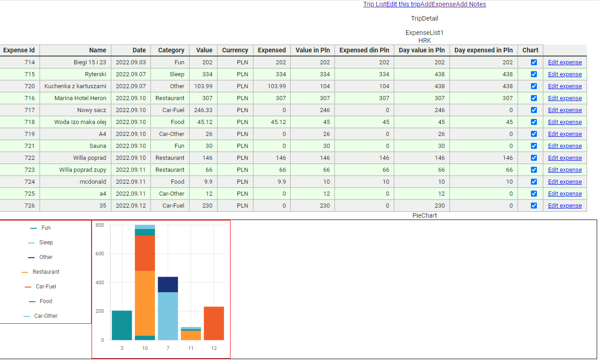

<!--Category:C#,SQL--> 
 

    <a href="http://productivitytools.tech/productivitytools-createsqlserverdatabase/"><a> 
    

    

# Trips

- Web to the trips application
- Allow to store the expences done during the trip
- Allow to store daily summary of the trip
